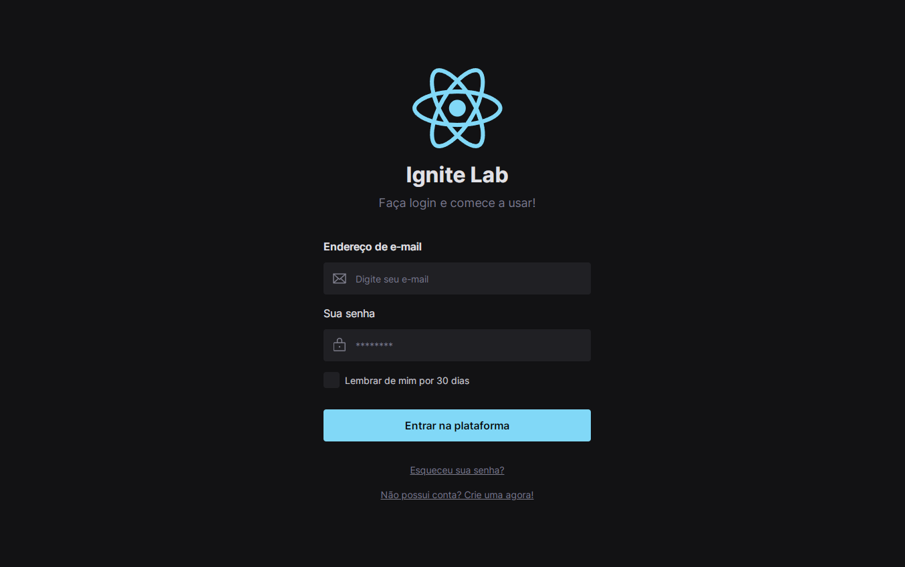

# Ignite Lab - Design System

> Projeto desenvolvido no **Ignite Lab 3** da Rocketseat. A aplicação foi desenvolvida por completa, desde o projeto dentro do Figma, criando todo o Design System até a construção em React.JS e finalizando com a documentação dos componentes utilizando o Storybook.

 

## Tecnologias e ferramentas utilizadas
- React.JS (Vite)
- TypeScript
- Radix UI
- Tailwind CSS
- Clsx
- Storybook
- Addon A11y
- Github Actions

Para acessar a documentação no Storybook [Clique aqui!](https://lailsonlm.github.io/ignite-lab-design-system/)